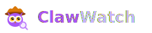
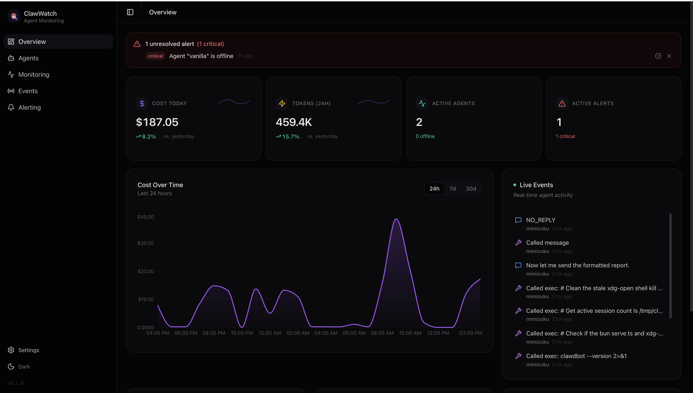

<div align="center">


<p>
  <a href="https://github.com/0xdsqr/clawwatch"></a>
  <a href="#"></a>
  <a href="#"></a>
  <a href="#"></a>
  <a href="#"></a>
</p>

**Self-hosted monitoring and cost management for AI agents.**

*Real-time visibility into costs, tokens, sessions, and system health from a single dashboard.*
</div>

<p align="center">
  
</p>

---

ClawWatch is a local-first monitoring system for agentic AI agents. Connect your agents through a WebSocket gateway and track everything from a single pane of glass:

- 💸 **Real-time cost tracking** - Monitor spend across providers and models as it happens, with projected burn rates and budget controls
- 🤖 **Multi-agent dashboard** - Unified view of all connected agents with live status, session counts, and per-agent cost breakdowns
- 🔔 **Smart alerting** - Configurable rules for budget thresholds, offline detection, error spikes, and cost anomalies with Discord, email, and webhook notifications
- 📡 **Live event stream** - Filterable, sortable log of all agent activity with level-based coloring, search, and real-time streaming
- 📊 **Token analytics** - Input/output/cache token breakdowns with model comparison tables and usage distribution charts
- 🏠 **Fully self-hosted** - Runs on your machine, data stays local, no external dependencies beyond a Convex backend

### Quick Start

```bash
# install dependencies
bun install

# start convex backend
cd packages/core && npx convex dev

# start the dashboard
cd apps/clawwatch && bun run dev
```

Set `GATEWAY_URL` and `GATEWAY_TOKEN` to connect the WebSocket collector to your agent gateway.

### Stack

- **Frontend**: React 19, TanStack Router, Tailwind CSS 4, Recharts
- **Backend**: Convex (real-time database + API)
- **Runtime**: Bun
- **Collector**: WebSocket + polling for live data ingestion
